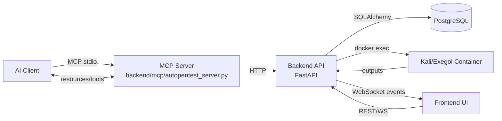

# AutoPentest System Features and How the System Works

This document summarizes the full feature set and runtime behavior of the AutoPentest (AIDA) codebase. It is grounded in the running code and in-repo docs.

## System Overview
AutoPentest is an AI-assisted penetration testing platform composed of:
- A FastAPI backend that persists assessments and coordinates command execution.
- A React frontend for operators to manage assessments and review findings.
- An MCP (Model Context Protocol) server that exposes tools to AI clients.
- A containerized pentesting environment (default: Kali container in Docker Compose) that runs security tools.

Primary entrypoints:
- Backend API: `backend/main.py`
- MCP server: `backend/mcp/autopentest_server.py`
- CLI launcher: `aida.py`
- Folder opener helper: `tools/folder_opener.py`
- Frontend: `frontend/src/main.jsx`

### High-Level Flow (Mermaid)

## Runtime Topology and Ports
Docker Compose describes the full stack in `docker-compose.yml`.
- PostgreSQL is exposed as `5433:5432`.
- Backend API is exposed as `8000:8000`.
- Frontend is exposed as `5173:5173`.
- Kali container is built from `Dockerfile.kali` and mounted at `/workspace`.

## Core Data Model (Database)
The backend uses SQLAlchemy models in `backend/models` and a PostgreSQL database configured in `backend/config.py` and `backend/database.py`.

Primary entities:
- Assessment (core engagement record)
- AssessmentSection (phase/section content)
- Card (findings, observations, info)
- ReconData (discovered assets and recon items)
- CommandHistory (command execution log)
- Credential (stored secrets and placeholders)
- Folder (assessment grouping)
- PendingCommand (approval queue)
- PlatformSettings (global config)

## Backend API Features
API routers are wired in `backend/main.py` and implemented under `backend/api`.

### Assessments
Implemented in `backend/api/assessments.py` and `backend/services/assessment_service.py`.
- Create assessments and initialize workspaces.
- List, update, delete, duplicate, and move assessments.
- Fetch a "full" assessment view with sections, cards, and recon data.

### Sections (Phases)
Implemented in `backend/api/sections.py`.
- Create, update, and delete phase content tied to an assessment.

### Cards (Findings, Observations, Info)
Implemented in `backend/api/cards.py`.
- CRUD for cards with type and severity.
- Linked to assessments and used for reporting and tracking.

### Reconnaissance Data
Implemented in `backend/api/recon.py`.
- CRUD for recon entries (endpoints, services, findings, etc).
- Batch import supported.

### Commands and Command History
Implemented in `backend/api/commands.py` and `backend/services/container_service.py`.
- Execute commands inside the container.
- Log stdout/stderr, return codes, and timestamps.
- Global commands view across assessments.
- Credential placeholder substitution endpoint (`/execute-with-credentials`).

## Testing Flow (End-to-End)
This is the typical testing lifecycle from setup to findings and review, as implemented in code and UI.

1. **Assessment creation (UI → API)**
Operator creates an assessment in the UI. Backend creates the assessment and initializes a workspace in the container via `AssessmentService.create_assessment`.
2. **AI session start (AI → MCP)**
AI connects to the MCP server and loads the assessment (`load_assessment`). MCP server pulls assessment context from the backend (metadata, recon, cards, command history).
3. **Recon and scanning (AI → MCP → Backend → Container)**
AI uses MCP tools such as `scan`, `subdomain_enum`, `tech_detection`, `http_send`, etc. Tools call into the backend or directly run commands in the container. Outputs are captured and stored in command history and recon data.
4. **Command execution with safety/approval**
`execute` tool checks safety classifier and command settings. If approval is required, a pending command is created and the UI is notified via WebSocket. Approved commands run in the container and results are stored.
5. **Findings and evidence**
AI creates cards (findings/observations/info) via MCP tools. Evidence and artifacts are stored in the evidence subsystem.
6. **Real-time UI updates (Backend → WebSocket → Frontend)**
WebSocket events notify the UI of new findings, recon updates, and command status. Operators can review command output and card details immediately.
7. **Optional scan import path**
Pre-run scans (nmap/nuclei/ffuf) can be uploaded. The scan importer parses and deduplicates results into recon data and cards.
### Credentials
Implemented in `backend/api/credentials.py`.
- Store credentials and expose placeholders for safe AI use.
- Fetch, update, and delete per assessment.

### Pending Commands and Approval Settings
Implemented in `backend/api/pending_commands.py`.
- Command approval modes: open, filter, closed.
- Keyword-based filter mode.
- Queue, approve, reject, and timeout pending commands.
- Broadcasts WebSocket events for UI updates.

### Context Documents
Implemented in `backend/api/context_documents.py`.
- Upload context files into the assessment workspace.
- List and delete context files.
- Workspace tree rendering via `backend/utils/tree_generator.py`.

### Search
Implemented in `backend/api/search.py` and `backend/services/search_service.py`.
- Unified search across assessments, commands, cards, and recon data.
- Scoring and basic fuzzy matching.

### System and Platform Settings
Implemented in `backend/api/system.py`.
- System status and info endpoints.
- Platform settings CRUD (stored in `PlatformSettings`).
- Container discovery and tool usage analytics.
- Host folder opener endpoint with path restrictions.

### WebSocket
Implemented in `backend/api/websocket.py` and `backend/websocket/manager.py`.
- Global event stream at `/ws`.
- Assessment-specific stream at `/ws/assessment/{assessment_id}`.
- Events standardized in `backend/websocket/events.py`.

## Command Execution and Approval Flow
Command execution is available in two paths:
- API calls to `backend/api/commands.py`.
- MCP tools via `backend/mcp/modules/tools_execution.py`.

Execution flow (MCP path):
1. AI calls MCP `execute` tool in `backend/mcp/modules/tools_execution.py`.
2. Safety classification is applied via `lib/safety_classifier.py`.
3. Backend command settings are fetched from `/command-settings`.
4. If approval is required, a `PendingCommand` is created and the MCP tool blocks while polling for approval.
5. Approved commands are executed by `ContainerService`, logged to `CommandHistory`, and broadcast to WebSockets.

Timeouts and approvals are enforced in `backend/api/pending_commands.py` with WebSocket notifications for UI consumers.

## Workspaces and Context Files
Workspace creation is triggered on assessment creation in `backend/services/assessment_service.py`.
- The workspace is created inside the container and stored on the assessment.
- Context documents are copied into the container via Docker file copy.
- Workspace paths can be resolved to host paths in `backend/services/workspace_service.py`.

## Scan Import and Recon Automation
Scan import is handled by `backend/services/scan_importer/importer.py`.
- Supports Nmap XML, Nuclei JSON/JSONL, and ffuf JSON.
- Parsers live under `backend/services/scan_importer`.
- Import pipeline detects format, parses items, deduplicates, and writes to ReconData and Cards.

## MCP Server and Tooling
The MCP server is defined in `backend/mcp/autopentest_server.py`.
- Tools are registered from multiple modules and dispatched through a registry.
- MCP resources are exposed in `backend/mcp/modules/resources.py` (example URIs: `kali://status`, `kali://containers`).

Tool categories (high level):
- Assessment management (`backend/mcp/modules/tools_assessment.py`)
- Cards management (`backend/mcp/modules/tools_cards.py`)
- Recon tracking (`backend/mcp/modules/tools_recon.py`)
- Command execution (`backend/mcp/modules/tools_execution.py`)
- Scanning and recon helpers (`backend/mcp/modules/tools_scanning.py`)
- Credential management (`backend/mcp/modules/tools_credentials.py`)
- Scope guard and budgets (`backend/mcp/modules/tools_scope.py`)
- HTTP client (`backend/mcp/modules/tools_http.py`)
- Fuzzer (`backend/mcp/modules/tools_fuzzer.py`)
- Nuclei integration (`backend/mcp/modules/tools_nuclei.py`)
- OpenAPI tooling (`backend/mcp/modules/tools_openapi.py`)
- Validation and evidence (`backend/mcp/modules/tools_validator.py`, `backend/mcp/modules/tools_evidence.py`)
- Auth testing (`backend/mcp/modules/tools_auth_tester.py`)
- World model knowledge graph (`backend/mcp/modules/tools_world_model.py` and `backend/mcp/modules/lib/world_model_db.py`)
- Browser automation (`backend/mcp/modules/tools_browser.py`)
- Risk, coverage, recon pipeline, endpoint analysis (`backend/mcp/modules/tools_risk.py`, `backend/mcp/modules/tools_coverage.py`, `backend/mcp/modules/tools_recon_pipeline.py`, `backend/mcp/modules/tools_endpoint_analysis.py`)

## Frontend Application
React app entrypoint is `frontend/src/main.jsx` with routing in `frontend/src/App.jsx`.

Pages:
- Dashboard
- Assessments list and detail
- Commands view
- Settings

UI infrastructure:
- Global WebSocket connection via `frontend/src/contexts/WebSocketContext.jsx` and `frontend/src/hooks/useWebSocket.js`.
- Pending command banner and notifications via `frontend/src/contexts/PendingCommandsContext.jsx` and `frontend/src/hooks/useCommandNotifications.js`.
- API calls centralized in `frontend/src/services` with axios client in `frontend/src/services/api.js`.

## Safety and Scope Controls
Safety and control features are distributed across MCP and backend:
- Safety classifier for command blocking in `backend/mcp/modules/lib/safety_classifier.py`.
- Command approval settings and keyword filters in `backend/api/pending_commands.py`.
- Scope validation and budgets via `backend/mcp/modules/tools_scope.py` and `backend/mcp/modules/lib/scope_validator.py`.

## Observability and Logging
Logging is centralized in `backend/utils/logger.py` with structured logging and middleware in `backend/middleware/logging_middleware.py`.

## Deployment and Configuration
Key operational scripts and config:
- `start.sh` and `restart.sh` for local orchestration.
- `start_mcp.sh` for MCP stdio server inside the backend container.
- Environment variables and defaults in `backend/config.py`.
- Docker Compose stack in `docker-compose.yml`.
